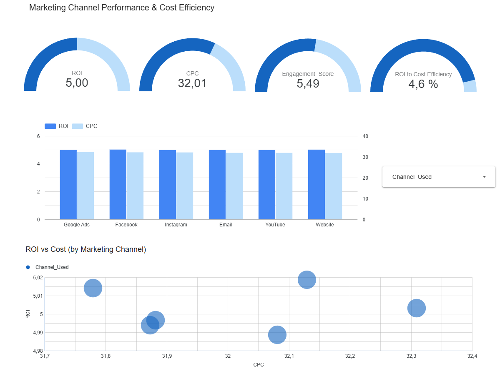

# marketing-campaign-performance-bigquery

SQL-based analysis of marketing campaign performance using Google BigQuery.
The project focuses on evaluating campaign effectiveness using key marketing KPIs such as ROI, conversion rate, acquisition cost, and engagement metrics.

## Dataset
Source: Kaggle – Marketing Campaign Performance Dataset

## Tools
- Google BigQuery
- SQL
- Looker Studio (optional dashboard)

## Data Exploration Notes

- Marketing channels are evenly distributed across the dataset, enabling fair performance comparison.
- This balanced structure minimizes channel-level bias during analysis.
- These observations were identified during the initial exploratory analysis phase.

## Key Findings

The analysis highlights clear differences in cost efficiency, profitability, and performance consistency across marketing channels:

- Facebook delivers the highest average ROI among marketing channels, suggesting stronger return efficiency relative to other platforms.
- Website campaigns are the most cost-efficient in terms of CPC.
- No strong tradeoff between CPC and ROI was observed across marketing channels, as performance metrics remain relatively consistent.
- Website and Facebook lead in average engagement score, although differences across channels are marginal.
- Click-through rate (CTR) is consistent across all channels, suggesting similar user response behavior regardless of channel.
- Google Ads has the highest average acquisition cost, suggesting higher investment requirements compared to other channels.
- Instagram achieves high ROI but at a higher acquisition cost, highlighting a profitability versus efficiency tradeoff.
- Google Ads exhibits the most consistent ROI, suggesting more stable and predictable performance across campaigns.
- Website offers the strongest balance between return and cost efficiency, generating the highest ROI per unit of acquisition cost.

## Dashboard (Looker Studio)

An executive dashboard was built using Looker Studio to visualize marketing campaign
performance across channels. The dashboard highlights key KPIs such as ROI, CPC,
engagement score, and ROI-to-cost efficiency, supporting data-driven channel
prioritization decisions.

🔗 **Interactive Dashboard:**  
https://lookerstudio.google.com/reporting/XXXXXXXX

### Marketing Channel Recommendation

Based on the combined analysis of ROI, cost efficiency, and performance consistency, **Website** emerges as the strongest channel to prioritize. Although Facebook leads in average ROI, Website offers the lowest CPC, comparable consistency to Google Ads, and the best balance between ROI and acquisition cost, making it the most efficient and reliable option overall.

